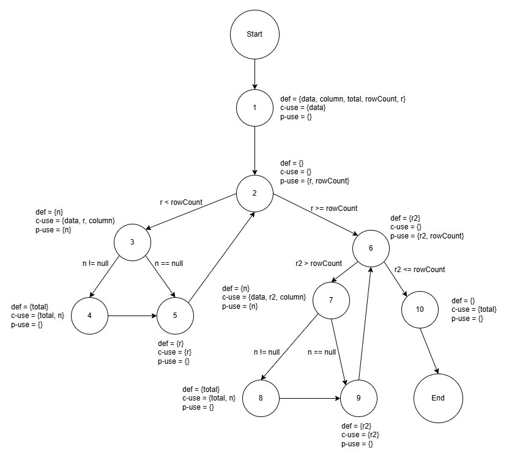

**SENG 637 - Dependability and Reliability of Software Systems**

**Lab. Report #3 – Code Coverage, Adequacy Criteria and Test Case Correlation**

| Group \#:      | 5        |
| -------------- | -------- |
| Student Names: | Lawrence |
|                | Kwesi    |
|                | Joe      |
|                | Zhanzhi  |

(Note that some labs require individual reports while others require one report
for each group. Please see each lab document for details.)

# 1 Introduction

Text…

# 2 Manual data-flow coverage calculations for DataUtilities.calculateColumnTotal and Y methods

## 2.1 DataUtilities.calculateColumnTotal

### Data Flow Graph

### Def-use Sets per Statement
|               |                                             |
| ------------- | ------------------------------------------- |
| **defs**:     | def(1) = {data, column, total, rowCount}    |
|               | def(2) = {r}                                |
|               | def(3) = {n}                                |
|               | def(4) = {total}                            |
|               | def(5) = {r}                                |
|               | def(6) = {r2}                               |
|               | def(7) = {n}                                |
|               | def(8) = {total}                            |
|               | def(9) = {r2}                               |
| **uses**:     | use(2) = {r, rowCount}                      |
|               | use(3) = {data, r, column, n}               |
|               | use(4) = {total, n}                         |
|               | use(5) = {r}                                |
|               | use(6) = {r2, rowCount}                     |
|               | use(7) = {data, r2, column, n}              |
|               | use(8) = {total, n}                         |
|               | use(9) = {r2}                               |
|               | use(10) = {total}                           |

### DU-pairs per variable

|               |                                                       |
| ------------- | ----------------------------------------------------- |
| **du-pairs**: | for data: (1, 2), (1, 3), (1, 5)                      |
|               | for column: (1, 5)                                    |
|               | for total: (3, 6), (3, 8), (6, 6), (6, 8)             |
|               | for rowCount: (3, 4)                                  |
|               | for r: (3, 4), (3, 5), (3, 7), (7, 4), (7, 5), (7, 7) |
|               | for n: (5, 5), (5, 6)                                 |

##### DU-pair coverage calculation per test case

| Variable | Def at node (n) | dcu(v, n) | dpu(v, n)        |
| -------- | --------------- | --------- | ---------------- |
| data     | 1               | {2, 3, 5} | {}               |
| column   | 1               | {5}       | {}               |
| r        | 3               | {5, 7}    | {(4, 5), (4, 8)} |
| r        | 7               | {5, 7}    | {(4, 5), (4, 8)} |
| rowCount | 3               | {}        | {(4, 5), (4, 8)} |
| total    | 3               | {6, 8}    | {}               |
| total    | 6               | {6, 8}    | {}               |
| n        | 5               | {6}       | {(5, 6), (5, 7)} |
|          | Total           | CU = 13   | PU = 8           |

| Test case                                        | Execution path                                   | DU-pairs covered                                                                                                                       | CUc + PUc                                                                                                 | All-uses coverage % |
| ------------------------------------------------ | ------------------------------------------------ | -------------------------------------------------------------------------------------------------------------------------------------- | --------------------------------------------------------------------------------------------------------- | ------------------- |
| `calculateColumnTotalAllRowsFirstColumn`         | [1, 2, 3, 4, 5, 6, 7, 4, 5, 6, 7, 4, 5, 6, 7, 8] | (1, 2), (1, 3), (1, 5), (1, 5), (3, 6), (3, 8), (6, 6), (6, 8), (3, 4), (3, 4), (3, 5), (3, 7), (7, 4), (7, 5), (7, 7), (5, 5), (5, 6) | {2,3,5}, {5}, {5, 7}, {5, 7}, {6, 8}, {6, 8}, {6}, (4, 5), (4, 8), (4, 5), (4, 8), (4, 5), (4, 8), (5, 6) | 95%                 |
| `calculateColumnTotalAllRowsMiddleColumn`        | [1, 2, 3, 4, 5, 6, 7, 4, 5, 6, 7, 4, 5, 6, 7, 8] | (1, 2), (1, 3), (1, 5), (1, 5), (3, 6), (3, 8), (6, 6), (6, 8), (3, 4), (3, 4), (3, 5), (3, 7), (7, 4), (7, 5), (7, 7), (5, 5), (5, 6) | {2,3,5}, {5}, {5, 7}, {5, 7}, {6, 8}, {6, 8}, {6}, (4, 5), (4, 8), (4, 5), (4, 8), (4, 5), (4, 8), (5, 6) | 95%                 |
| `calculateColumnTotalAllRowsLastColumn`          | [1, 2, 3, 4, 5, 6, 7, 4, 5, 6, 7, 4, 5, 6, 7, 8] | (1, 2), (1, 3), (1, 5), (1, 5), (3, 6), (3, 8), (6, 6), (6, 8), (3, 4), (3, 4), (3, 5), (3, 7), (7, 4), (7, 5), (7, 7), (5, 5), (5, 6) | {2,3,5}, {5}, {5, 7}, {5, 7}, {6, 8}, {6, 8}, {6}, (4, 5), (4, 8), (4, 5), (4, 8), (4, 5), (4, 8), (5, 6) | 95%                 |
| `calculateColumnTotalWithMaxValueAndFirstColumn` | [1, 2, 3, 4, 5, 6, 7, 4, 5, 6, 7, 4, 5, 6, 7, 8] | (1, 2), (1, 3), (1, 5), (1, 5), (3, 6), (3, 8), (6, 6), (6, 8), (3, 4), (3, 4), (3, 5), (3, 7), (7, 4), (7, 5), (7, 7), (5, 5), (5, 6) | {2,3,5}, {5}, {5, 7}, {5, 7}, {6, 8}, {6, 8}, {6}, (4, 5), (4, 8), (4, 5), (4, 8), (4, 5), (4, 8), (5, 6) | 95%                 |
| `calculateColumnTotalWithMinValueAndFirstColumn` | [1, 2, 3, 4, 5, 6, 7, 4, 5, 6, 7, 4, 5, 6, 7, 8] | (1, 2), (1, 3), (1, 5), (1, 5), (3, 6), (3, 8), (6, 6), (6, 8), (3, 4), (3, 4), (3, 5), (3, 7), (7, 4), (7, 5), (7, 7), (5, 5), (5, 6) | {2,3,5}, {5}, {5, 7}, {5, 7}, {6, 8}, {6, 8}, {6}, (4, 5), (4, 8), (4, 5), (4, 8), (4, 5), (4, 8), (5, 6) | 95%                 |
| `calculateColumnTotalWithMaxValueColumn`         | [1, 2, 3, 4, 5, 6, 7, 4, 5, 6, 7, 4, 5, 6, 7, 8] | (1, 2), (1, 3), (1, 5), (1, 5), (3, 6), (3, 8), (6, 6), (6, 8), (3, 4), (3, 4), (3, 5), (3, 7), (7, 4), (7, 5), (7, 7), (5, 5), (5, 6) | {2,3,5}, {5}, {5, 7}, {5, 7}, {6, 8}, {6, 8}, {6}, (4, 5), (4, 8), (4, 5), (4, 8), (4, 5), (4, 8), (5, 6) | 95%                 |
| `calculateColumnTotalWithMinValueColumn`         | [1, 2, 3, 4, 5, 6, 7, 4, 5, 6, 7, 4, 5, 6, 7, 8] | (1, 2), (1, 3), (1, 5), (1, 5), (3, 6), (3, 8), (6, 6), (6, 8), (3, 4), (3, 4), (3, 5), (3, 7), (7, 4), (7, 5), (7, 7), (5, 5), (5, 6) | {2,3,5}, {5}, {5, 7}, {5, 7}, {6, 8}, {6, 8}, {6}, (4, 5), (4, 8), (4, 5), (4, 8), (4, 5), (4, 8), (5, 6) | 95%                 |
| `calculateColumnTotalWithSumOf0AndFirstColumn`   | [1, 2, 3, 4, 5, 6, 7, 4, 5, 6, 7, 4, 5, 6, 7, 8] | (1, 2), (1, 3), (1, 5), (1, 5), (3, 6), (3, 8), (6, 6), (6, 8), (3, 4), (3, 4), (3, 5), (3, 7), (7, 4), (7, 5), (7, 7), (5, 5), (5, 6) | {2,3,5}, {5}, {5, 7}, {5, 7}, {6, 8}, {6, 8}, {6}, (4, 5), (4, 8), (4, 5), (4, 8), (4, 5), (4, 8), (5, 6) | 95%                 |

**Total**

CUc + PUc = 20

CU + PU = 21

All-uses coverage = 95%
# 3 A detailed description of the testing strategy for the new unit test

Text…

# 4 A high level description of five selected test cases you have designed using coverage information, and how they have increased code coverage

Text…

# 5 A detailed report of the coverage achieved of each class and method (a screen shot from the code cover results in green and red color would suffice)

Text…

# 6 Pros and Cons of coverage tools used and Metrics you report

Text…

# 7 A comparison on the advantages and disadvantages of requirements-based test generation and coverage-based test generation.

Text…

# 8 A discussion on how the team work/effort was divided and managed

Text…

# 9 Any difficulties encountered, challenges overcome, and lessons learned from performing the lab

Text…

# 10 Comments/feedback on the lab itself

Text…
