**SENG 637 - Dependability and Reliability of Software Systems**

**Lab. Report #3 – Code Coverage, Adequacy Criteria and Test Case Correlation**

| Group \#:      | 5        |
| -------------- | -------- |
| Student Names: | Lawrence |
|                | Kwesi    |
|                | Joe      |
|                | Zhanzhi  |


# 1 Introduction

In this lab, we performed white box testing techniques on the Range class and DataUtilities from the JFreeChart library. We manually calculated the data-flow coverage for two methods and used coverage tools like EclEmma. By analyzing the code coverage, we designed new test cases to cover more branches and statements.

# 2 Manual data-flow coverage calculations for DataUtilities.calculateColumnTotal and Y methods

## 2.1 DataUtilities.calculateColumnTotal

### Data Flow Graph


### Def-use Sets per Statement
|               |                                             |
| ------------- | ------------------------------------------- |
| **defs**:     | def(1) = {data, column, total, rowCount}    |
|               | def(2) = {r}                                |
|               | def(3) = {n}                                |
|               | def(4) = {total}                            |
|               | def(5) = {r}                                |
|               | def(6) = {r2}                               |
|               | def(7) = {n}                                |
|               | def(8) = {total}                            |
|               | def(9) = {r2}                               |
|               |                                             |
| **uses**:     | use(1) = {data}                             |
|               | use(2) = {r, rowCount}                      |
|               | use(3) = {data, r, column, n}               |
|               | use(4) = {total, n}                         |
|               | use(5) = {r}                                |
|               | use(6) = {r2, rowCount}                     |
|               | use(7) = {data, r2, column, n}              |
|               | use(8) = {total, n}                         |
|               | use(9) = {r2}                               |
|               | use(10) = {total}                           |

### DU-pairs per variable

| **Variable**  | **Pairs**                                         |
| ------------- | ------------------------------------------------- |
| data          | (1, 1), (1, 3), (1, 7)                            |
| column        | (1, 3), (1, 7)                                    |
| total         | (1, 4), (1, 8), (1, 10), (4, 4), (4, 8), (4, 10), (8, 8), (8, 10) |
| rowCount      | (1, 2), (1, 6)                                    |
| r             | (2, 2), (2, 3), (2, 5), (5, 2), (5, 3), (5, 5)    |
| n             | (3, 3), (3, 4), (7, 7), (7, 8)                    |
| r2            | (6, 6), (6, 7), (6, 9), (9, 6), (9, 7), (9, 9)    |

#### Infeasible path

For the loop of r2, since r2 starts at 0 and rowCount >= 0, r2 will never be greater than rowCount. Which means nodes 7, 8, and 9 are not reachable. Therefore, after excluding them:
| **Variable**  | **Pairs**                                      |
| ------------- | ---------------------------------------------- |
| data          | (1, 1), (1, 3)                                 |
| column        | (1, 3)                                         |
| total         | (1, 4), (1, 10), (4, 4), (4, 10)               |
| rowCount      | (1, 2), (1, 6)                                 |
| r             | (2, 2), (2, 3), (2, 5), (5, 2), (5, 3), (5, 5) |
| n             | (3, 3), (3, 4)                                 |
| r2            | (6, 6)                                         |

Number of reachable pairs = 18

### DU-pair coverage per test case

#### 2.1.1. calculateColumnTotalForTwoValuesWithLBColumn()
- What it does: Calculates the total for a valid column containing 7.5 and -2.5.
- Execution Path: 1, 2, 3, 4, 5, 2, 3, 4, 5, 2, 6, 10
- DU-pair covered:  

| **Variable**  | **Pairs**                                      |
| ------------- | ---------------------------------------------- |
| data          | (1, 1), (1, 3)                                 |
| column        | (1, 3)                                         |
| total         | (1, 4), (4, 4), (4, 10)                        |
| rowCount      | (1, 2), (1, 6)                                 |
| r             | (2, 2), (2, 3), (2, 5), (5, 2), (5, 3), (5, 5) |
| n             | (3, 3), (3, 4)                                 |
| r2            | (6, 6)                                         |
- DU-pair coverage = 17 / 18 = 94.4%

#### 2.1.2. calculateColumnTotalForNull()
- What it does: Passes null as the data table, expecting an InvalidParameterException.
- Execution Path: 1 (Throws Exception immediately at ParamChecks)
- DU-pair covered:  

| **Variable**  | **Pairs**                                      |
| ------------- | ---------------------------------------------- |
| data          | (1, 1)                                         |
- DU-pair coverage = 1 / 18 = 5.6%

#### 2.1.3. calculateColumnTotalForValuesWithNullAndBUBColumn()
- What it does: Calculates the total for a column where the first row is 4.0 and the second row is null.
- Execution Path: 1, 2, 3, 4, 5, 2, 3, 5, 2, 6, 10 (skips 4 for null)
- DU-pair covered:  

| **Variable**  | **Pairs**                                      |
| ------------- | ---------------------------------------------- |
| data          | (1, 1), (1, 3)                                 |
| column        | (1, 3)                                         |
| total         | (1, 4), (4, 10)                                |
| rowCount      | (1, 2), (1, 6)                                 |
| r             | (2, 2), (2, 3), (2, 5), (5, 2), (5, 3), (5, 5) |
| n             | (3, 3), (3, 4)                                 |
| r2            | (6, 6)                                         |
- DU-pair coverage = 16 / 18 = 88.9%

#### 2.1.4. calculateColumnTotalForBLBColumn()
- What it does: Requests BLB column -1.
- Execution Path: 1, 2, 3 (Throws Exception at getValue)
- DU-pair covered:

| **Variable**  | **Pairs**      |
| ------------- | -------------- |
| data          | (1, 1), (1, 3) |
| column        | (1, 3)         |
| rowCount      | (1, 2)         |
| r             | (2, 2), (2, 3) |
- DU-pair coverage = 6 / 18 = 33.3%

#### 2.1.5. calculateColumnTotalForUBColumn()
- What it does: Requests UB column 2.
- Execution Path: 1, 2, 3 (Throws Exception at getValue)
- DU-pair covered:  

| **Variable**  | **Pairs**      |
| ------------- | -------------- |
| data          | (1, 1), (1, 3) |
| column        | (1, 3)         |
| rowCount      | (1, 2)         |
| r             | (2, 2), (2, 3) |
- DU-pair coverage = 6 / 18 = 33.3%

## 2.2 Range.contains(double value)

## Source Code

```java
public boolean contains(double value) {
    if (value < this.lower) {           // statement 2
        return false;                   // statement 3
    }
    if (value > this.upper) {           // statement 4
        return false;                   // statement 5
    }
    return (value >= this.lower        // statement 6
            && value <= this.upper);
}
```
### Data Flow Graph



### Def-use Sets per Statement


| Node | Statement | DEF | USE |
|------|-----------|-----|-----|
| 1 | Entry — `boolean contains(double value)` | `{ value }` | `{ }` |
| 2 | `if (value < this.lower)` | `{ }` | `{ value, this.lower }` |
| 3 | `return false` *(value below range)* | `{ }` | `{ }` |
| 4 | `if (value > this.upper)` | `{ }` | `{ value, this.upper }` |
| 5 | `return false` *(value above range)* | `{ }` | `{ }` |
| 6 | `return (value >= this.lower && value <= this.upper)` | `{ }` | `{ value, this.lower, this.upper }` |
| 7 | Exit | `{ }` | `{ }` |


### DU-pairs per variable
#### Variable: `value`

Defined at: **Node 1** (entry parameter)

| DU-Pair | DEF node | USE node | Use type | Path |
|---------|----------|----------|----------|------|
| (1, 2) | 1 | 2 | predicate-use (p-use) | 1 → 2 |
| (1, 4) | 1 | 4 | predicate-use (p-use) | 1 → 2 → 4 |
| (1, 6) | 1 | 6 | computation-use (c-use) | 1 → 2 → 4 → 6 |

**Total DU-pairs for `value`: 3**

---

#### Variable: `this.lower`

Defined at: **Range constructor** (outside this method)

| DU-Pair | DEF node | USE node | Use type | Path |
|---------|----------|----------|----------|------|
| (ctor, 2) | constructor | 2 | predicate-use (p-use) | entry → 2 |
| (ctor, 6) | constructor | 6 | computation-use (c-use) | entry → 2 → 4 → 6 |

**Total DU-pairs for `this.lower`: 2**

---

#### Variable: `this.upper`

Defined at: **Range constructor** (outside this method)

| DU-Pair | DEF node | USE node | Use type | Path |
|---------|----------|----------|----------|------|
| (ctor, 4) | constructor | 4 | predicate-use (p-use) | entry → 2 → 4 |
| (ctor, 6) | constructor | 6 | computation-use (c-use) | entry → 2 → 4 → 6 |

**Total DU-pairs for `this.upper`: 2**

---

#### Summary

| Variable | DEF node | Total DU-pairs | p-use | c-use |
|----------|----------|----------------|-------|-------|
| `value` | Node 1 (entry) | 3 | 2 | 1 |
| `this.lower` | Constructor | 2 | 1 | 1 |
| `this.upper` | Constructor | 2 | 1 | 1 |
| **Total** | | **7** | **4** | **3** |

---

## DU-Pair Coverage by Test Case

| Test case | Input | (1,2) value | (1,4) value | (1,6) value | (ctor,2) lower | (ctor,4) upper | (ctor,6) lower | (ctor,6) upper |
|-----------|-------|:-----------:|:-----------:|:-----------:|:--------------:|:--------------:|:--------------:|:--------------:|
| `testContainsBelowLowerBound` (0.0) | below range | ✅ | ❌ | ❌ | ✅ | ❌ | ❌ | ❌ |
| `testContainsAtLowerBoundary` (1.0) | at lower | ✅ | ✅ | ✅ | ✅ | ✅ | ✅ | ✅ |
| `testContainsMidRange` (3.0) | inside | ✅ | ✅ | ✅ | ✅ | ✅ | ✅ | ✅ |
| `testContainsAtUpperBoundary` (5.0) | at upper | ✅ | ✅ | ✅ | ✅ | ✅ | ✅ | ✅ |
| `testContainsAboveUpperBound` (6.0) | above range | ✅ | ✅ | ❌ | ✅ | ✅ | ❌ | ❌ |

**All 7 DU-pairs are covered across the test suite.**


# 3 A detailed description of the testing strategy for the new unit test

Based on the code coverage provided by EclEmma on our old test cases (assignment 2), we analyzed and identified uncovered instructions and branches. Then, we applied data flow analysis techniques like drawing CFGs and DFGs, and designed new test cases that cover more nodes and paths.

# 4 A high level description of five selected test cases you have designed using coverage information, and how they have increased code coverage

## 4.1 DataUtilitiesTest.calculateRowTotalForValuesWithNullAndBUBRow()

This test case calls calculateRowTotal for a row containing 6.0 and null. By adding a null value to the data, it covers both branches of the 'if (n != null)' statements, increasing the branch coverage.

## 4.2 DataUtilitiesTest.getCumulativePercentagesForDataContainsNull()

This test case calls getCumulativePercentages for 5 and null. Similar to 4.1, the null value helps to cover both branches of the 'if (v != null)' statements, increasing the branch coverage.

## 4.3 RangeTest.testConstrain_NaNInput_ReturnsNaN
### Method under test: Range.constrain(double value)
### Coverage gap identified:
EclEmma showed the constrain() method at 60% statement coverage. The missed
statements were inside the block reached when contains(value) returns false
but the value is NaN.

## 4.4 RangeTest.testExpand_LargeNegativeMargins_InvertsAndAverages
### Method under test: Range.expand(Range range, double lowerMargin, double upperMargin)
### Coverage gap identified:
EclEmma showed a missed branch inside expand(). Using margins of which inverts the range and
forces the guard condition true increased the code coverage 

## 4.5 RangeTest.testEquals_SameObjectReference_ReturnsTrue
### Method under test: Range.equals(Object obj)
### Coverage gap identified: 
EclEmma showed a missed statement at the very top of equals().This single test increased the coverage.


# 5 A detailed report of the coverage achieved of each class and method (a screen shot from the code cover results in green and red color would suffice)

## 5.2 DataUtilities

| Method                   | Instructions | Branches | Complexity |
| ------------------------ | ------------ | -------- | ---------- |
| createNumberArray        | 100%         | 100%     | 100%       |
| createNumberArray2D      | 100%         | 100%     | 100%       |
| getCumulativePercentages | 85.2%        | 75.0%    | 71.4%      |
| calculateColumnTotal     | 72.9%        | 62.5%    | 60.0%      |
| calculateRowTotal        | 72.9%        | 62.5%    | 60.0%      |

### Infeasible paths

As discussed in 2.1, the loop of r2 in calculateColumnTotal is not reachable. For the same reason, the loop of c2 in calculateRowTotal and the loop of i2 in getCumulativePercentages are also not reachable. These infeasible paths are the main cause of the loss in coverage.

### Instructions coverage


### Branches coverage


### Complexity coverage


## 5.3 Range

| Method                   | Instructions | Branches | Method |
| ------------------------ | ------------ | -------- | ---------- |
| contains        | 100%         | 87.5%     | 100%       |
| equals     | 100%         | 100%     | 100%       |
| constrain | 100%         | 100%    | 100%       |
| intersects     | 100%          | 87.5%    | 100%       |
| combine        | 100%         | 100%    | 100%       |

### Instructions/Statement coverage


### Branches coverage


### Method coverage


# 6 Pros and Cons of coverage tools used and Metrics you report

## EclEmma

Pros:
- It integrates directly into the Eclipse workbench, no setup or installation required
- It is actively maintained and updated by Eclipse
- It provides many useful coverage data and visuals

Cons:
- Does not work with Mock

## CodeCover, Clover, Coverlipse, Cobertura

Cons:
- None of them are officially maintained and supported anymore
- Some of them (like CodeCover) may not be installed anymore

# 7 A comparison on the advantages and disadvantages of requirements-based test generation and coverage-based test generation.

## requirements-based

Pros:
- Identifies inconsistencies and ambiguities in requirements
- Ensures the code aligns closely with user requirements

Cons:
- Requires high-quality documentation
- May miss technical details

## coverage-based

Pros:
- Identifies unused and redundant codes
- Offers measurable metrics for test case coverage and quality

Cons:
- Cannot detect missing requirements
- The coverage metrics do not imply that the codes or logics are correctly verified

# 8 A discussion on how the team work/effort was divided and managed

## Work distribution
- Lawrence & Kwesi: RangeTest
- Joe & Zhanzhi: DataUtilitiesTest

# 9 Any difficulties encountered, challenges overcome, and lessons learned from performing the lab

- Found that EclEmma did not work with mock, and had to rewrite all test cases that used mock to get EclEmma working.

# 10 Comments/feedback on the lab itself

Text…
